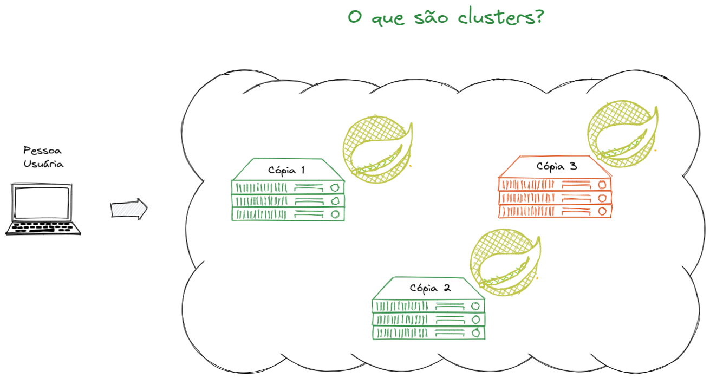

### Dia 24.1 - Updates simples

--

### Dia 24.1 - Updates simples

Vamos passar pelos métodos: 
- `updateOne()` & `updateMany()`
- `$set`, `$mul`, `$inc`, `$min`, `$max`, 
- `$currentDate`, `$rename` & `$unset`.

---

### updateOne()

> Atualiza o **primeiro** documento encontrado pelo filtro da query

--

### updateOne()

> Sintaxe

```js
db.collection.updateOne(
  { /* query filter */ } // filtro onde deve ocorrer a alteração
  { /* operations */ }   // o que fazer com esse documento?
  { /* options */ }      // opções extras
)
```

--

### updateOne()

> Restaurando o backup dentro de `dataset.js`

--

### updateOne()

> Atualize todos os documentos onde a escola é `Turma 13 B` para `GuiSchool`

--

### UpdateOne()

```js
db.school.updateOne(
  { school: "Turma 13 B"}, // filtro
  { 
    $set: {                // operação
      school: "GuiSchool"
    }
  }
);
```

--

### updateOne()

> Análise o retorno

```json
{ 
  "acknowledged" : true, 
  "matchedCount" : 1, 
  "modifiedCount" : 1 
}
```

--

### UpdateOne()

- `acknowledged`: A alteração foi replicada em 70% das cópias;
- `matchedCount` : Docs encontrados pelo filtro;
- `modifiedCount`: Docs modificados dentro do filtro.

--

### UpdateOne()



---

### UpdateMany()

> Atualiza **todos** documentos encontrado pelo filtro da query

--

### UpdateMany()

> Sintaxe

```js
db.collection.updateMany(
  { /* query filter */ } // filtro onde deve ocorrer a alteração
  { /* operations */ }   // o que fazer com esse documento?
  { /* options */ }      // opções extras
)
```

--

### UpdateMany()

> Análise o retorno

```json
{ 
  "acknowledged" : true, 
  "matchedCount" : 999, 
  "modifiedCount" : 999 
}
```

--

### UpdateMany() - Atomicidade

> "Tudo ou nada", "ou da certo ou não altera nada".

--

### UpdateMany() - `$upsert`

> Caso nenhum documento da collection seja satisfeito o operador $upsert criará um novo documento

--

### UpdateMany() - `$upsert`.

```js
db.students.updateOne(
  { name: "Ada" },         // filtro
  {
    $set: {                // operação
      school: "Trybe Beyond",
      bestScore: 99999,
      active: false
    }
  },
  { upsert: true }         // opção
);
```

--

### UpdateMany() - `$upsert`

```js
{
  "acknowledged" : true,
  "matchedCount" : 0,
  "modifiedCount" : 0,
  "upsertedId" : ObjectId("5e5bcfb1389e351989e500d9")
}
```

---

### O atributo `_id`

- É o único campo requerido dentro de um documento;
- Podemos compara-lo a `PK` _(primary key)_ em bancos relacionais;
- É possível atribuir um valor de forma manual _(não recomendado)_;
- Imutável, não pode ser alterado;
- É do tipo ObjectId;

--

### ObjectId

- Hexadecimal composto por 12 bytes;
- 4 bytes: **timestamp**, representando a data de criação, medida em segundos desde a Unix epoch
- 5 bytes: valores aleatórios;
- 3 bytes: **contador incremental**, iniciado de forma aleatória.

--

### ObjectId


---

### Operador `$set`

> Vamos alterar a collection para `products`

--

### Operador `$set`

```js
db.products.insertOne(
  {
    _id: 100,
    sku: "abc123",
    quantity: 250,
    instock: true,
    details: { model: "14Q2", make: "xyz" },
    tags: [ "apparel", "clothing" ],
    ratings: [ { by: "John Doe", rating: 4 } ]
  }
);
```

--

### Operador `$set`- primeiro nível do documento

- Altere a `quantity` para *500*.
- `details` receberá um novo documento
- `tags` receberá um novo array com os valores `coats`, `outerwear`, `clothing`

--

### Operador `$set`

```js
db.products.updateOne(
  { _id: 100 },
  {
    $set: {
      quantity: 500,
      details: { model: "15Z9", make: "xyz" },
      tags: ["coats", "outerwear", "clothing"]
    }
  }
);
```

--

### Operador `$set` - subdocumentos

- Atualize o campo `make` dentro de `details` para `zzz`

--

### Operador `$set` - subdocumentos

```
db.products.updateOne(
  { _id: 100 },
  { $set: { "details.make": "zzz" } }
);
```

--

### Operador `$set` - Arrays

> Uma das formas de alterar valores em arrays é indicando a posição do elemento dentro do array. Essa posição é sempre iniciada em 0.

--

### Operador `$set` - Arrays

- Vamos alterar o segundo elemento do array `tags` e o primeiro elemento do array `ratings` no documento em que o `_id` seja igual a *100*.

```js
db.products.updateOne(
  { _id: 100 },
  {
    $set: {
      "tags.1": "rain gear",
      "ratings.0.rating": 2
    }
  }
);
```

---

### Operador `$mul ...tiplicação`

> Vamos calcular a possível "receita" máxima do produto de id 100.

--

### Operador `$mul`

> Ainda não temos as ferramentas necessárias para o cálculo, pois não temos o valor de cada unidade, vamos supor que o valor seja $1.85

```js
db.products.updateOne(
  { _id: 100 },
  {
    $set: {
      receitaMaxima: 1.85
    }
  }
);
```

--

### Operador `$mul`

> Sabendo a quantidade de itens no estoque e também o valor unitário, podemos realizar a $mul..tiplicação

--

### Operador `$mul`

```js
db.products.updateOne(
  { _id: 100 },
  {
    $mul: {
      // multipliando o campo receitaMaxima por 500
      receitaMaxima: 500
    }
  }
);

```

---

### Operador `$inc ...remento`

- Quando utilizado com valores **positivos** incrementa o valor do campo especificado.

- Quando utilizado com valores **negativos** decrementa o valor do campo especificado.

--

### Operador `$inc`

> Vamos imaginar que algumas pessoas fizeram a devolução de 2 produtos

--

### Operador `$inc`

```js
db.products.updateOne(
  { _id: 100 },
  {
    $inc: {
      quantity: 2
    }
  }
);
```

--

### Operador `$inc`

> Nossa receita total agora está errada, vamos corrigir.
 
-- 

### Operador `$inc`

```js
db.products.updateOne(
  { _id: 100 },
  {
    $inc: {
      receitaTotal: 2 * 1.75
    }
  }
);
```

--

### Operador `$inc`

> Vamos imagina que agora foram vendidas 8 unidades (faça a alteração de forma simultânea).

--

### Operador `$inc`

```js
db.products.updateOne(
  { _id: 100 },
  {
    $inc: {
      receitaTotal: (-8) * 1.75,
      quantity: -8
    }
  }
);
```

---

### Operadores `$min` e `$max`

--

### Operador `$min`

> Se você utilizar o método $min, o MongoDB comparará o valor do campo no documento com o valor especificado na operação. Se o valor passado na comparação for menor do que o valor atual do campo, a alteração será feita.

--

### Operador `$min`

```js
db.products.find({ _id: 100 });

db.products.updateOne(
  { _id: 100 },
  {
    $min: { "quantity": 1000 }
  }
);

db.products.updateOne(
  { _id: 100 },
  {
    $min: { "quantity": 50 }
  }
);
```

--

### Operador `$max`

> De forma semelhante ao $min, se você utilizar o método $max, o MongoDB comparará o valor do campo no documento com o valor especificado na operação. Se o valor passado na comparação for maior do que o valor atual do campo, a alteração será feita.

--

### Operador `$max`

```js
db.products.updateOne(
  { _id: 100 },
  {
    $max: { "quantity": 200 }
  }
);

db.products.updateOne(
  { _id: 100 },
  {
    $max: { "quantity": 6789 }
  }
);
```

---

### Operador #rename

> É possível alterar o nome de um atributo dependendo do critério do filtro

```js
db.products.updateOne(
  { _id: 100 },
  {
    $rename: {
      "sku": "codigo"
    }
  }
);
```

---

### Operador $unset

> remove um ou mais campos de documentos e, assim como o operador $rename, aceita um filtro para a seleção desses documentos.

--

### Operador $unset

```js
db.products.updateOne(
  { _id: 100 },
  {
    $unset: {
      "receitaMaxima": ""
    }
  }
);
```

---

## Dúvidas ?

---

### Operador $currentDate()

```js
db.products.updateOne(
  { _id: 100 },
  {
    $currentDate: {
      "updated.data": true,
    }
  }
);

db.products.findOne(
  { _id: 100 }
);
```