### JWT - JSON WEB TOKEN

{width=60%}

---

### O que teremos hoje?

- Segurança 💚
- JWT

---

### Como um sistema funciona?

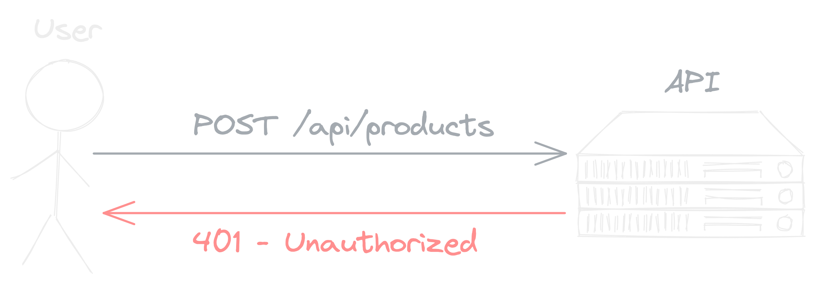

---

### Faço o login

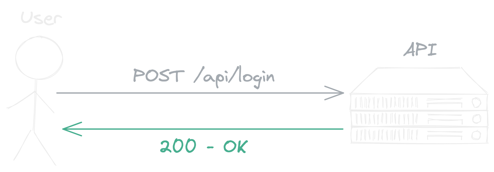

---

### Crio com sucesso

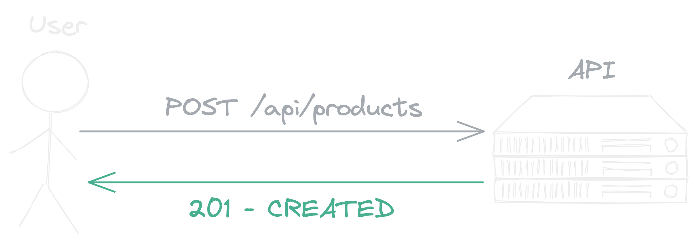

---

#### Mas como a API sabe que estou logado?

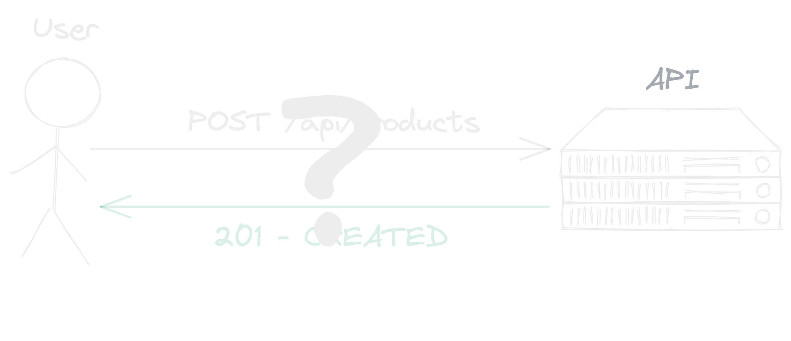

---

#### Uma das formas é com JWT - (JSON Web Token)

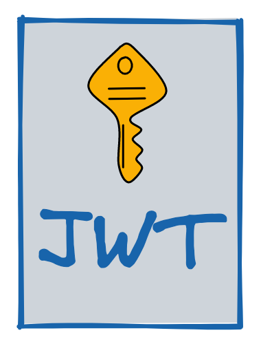

---

# Cafeteria ☕️

---

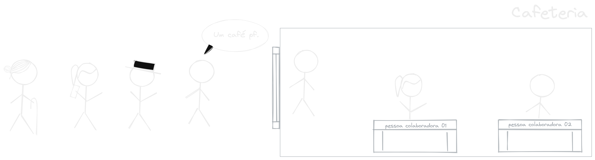

---

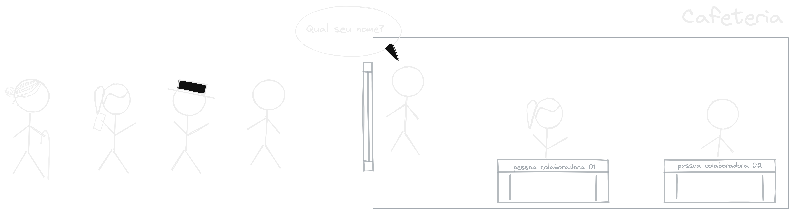

---

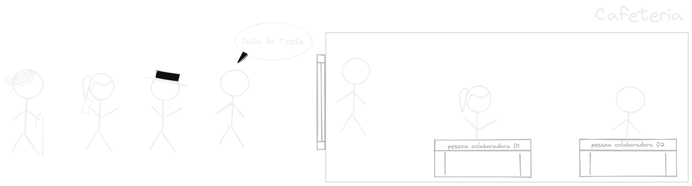

---

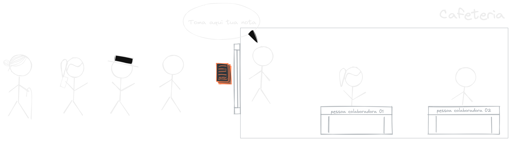

---

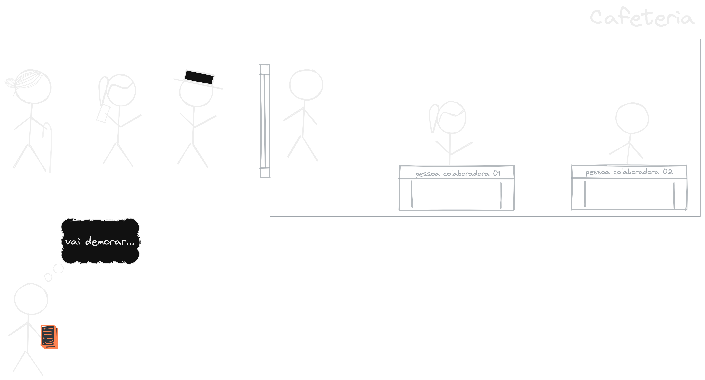

---

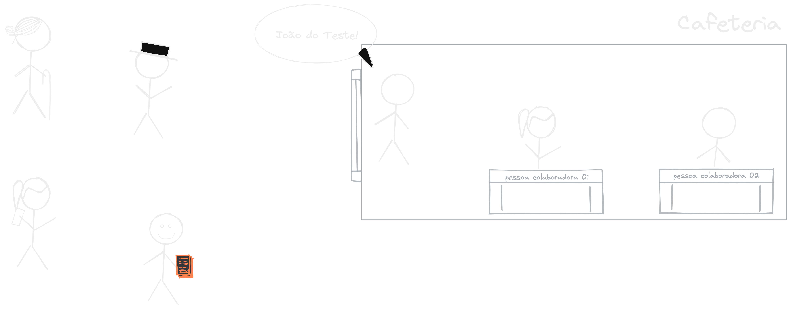

---

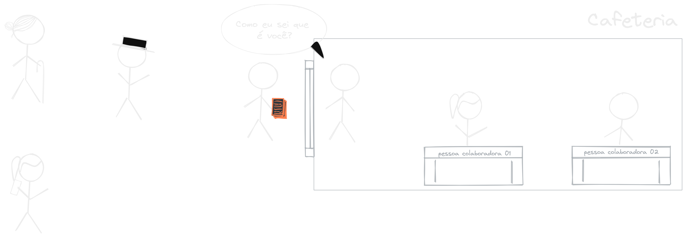

---

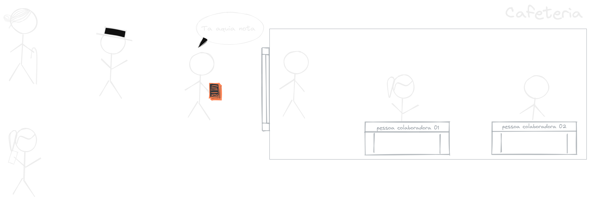

---

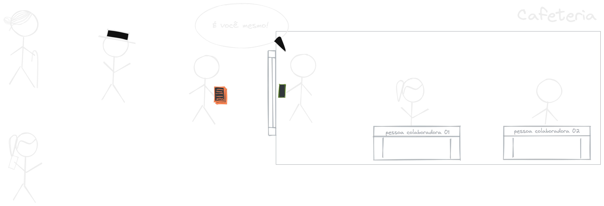

---

### Quando eu faço o login

---

### Quando eu faço o login

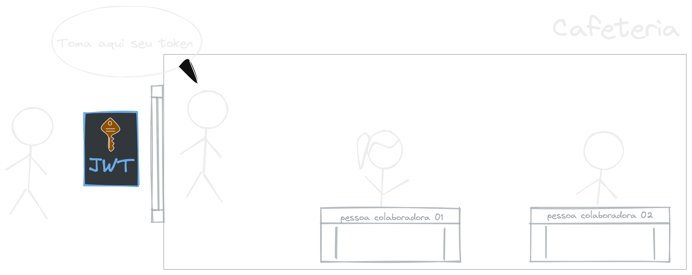

---

### Em todas as requisições

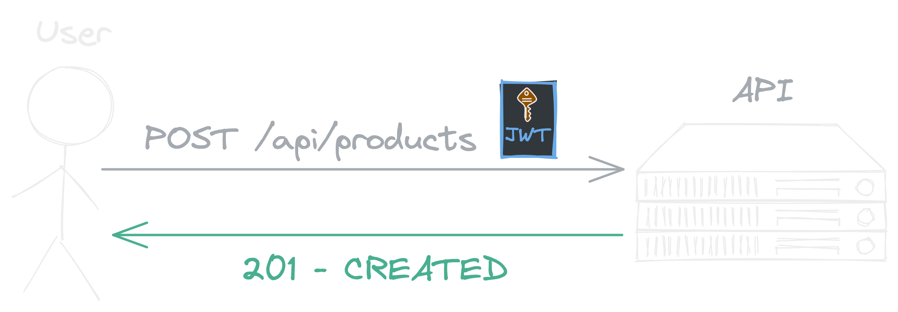

---

### O que tem dentro desse token?

---

### Estrutura de um token

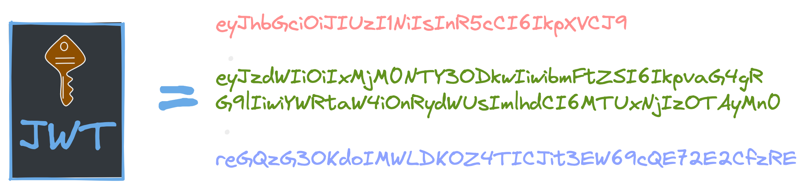

---

### Estrutura de um token

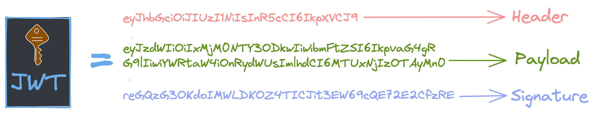

---

### Base 64?

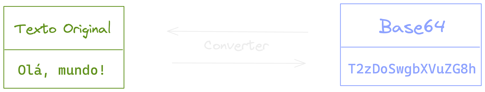

---

### Header - Base 64

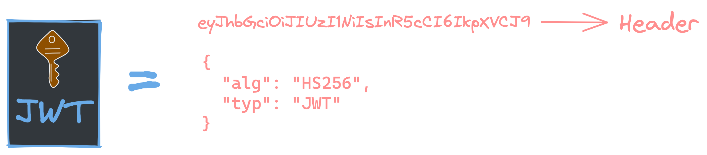

---

### Payload - Base 64

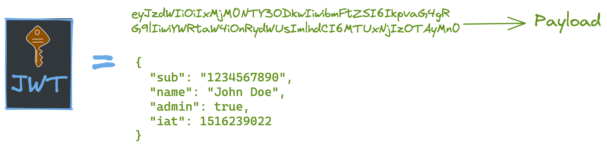

---

### Signature - Hash criptografica

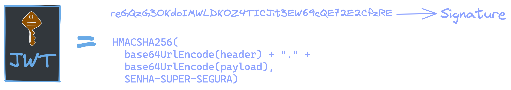

---

### Como funciona esse tal de HMAC

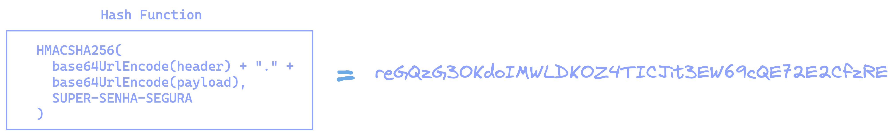

---

### Não importa quantas vezes

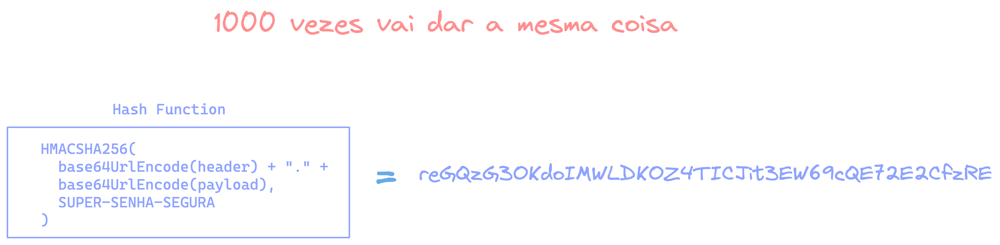

---

#### Diferente do base 64 auqi não tem volta

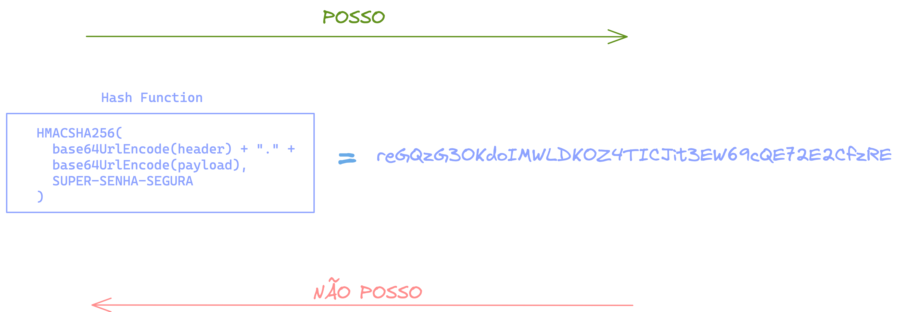

---

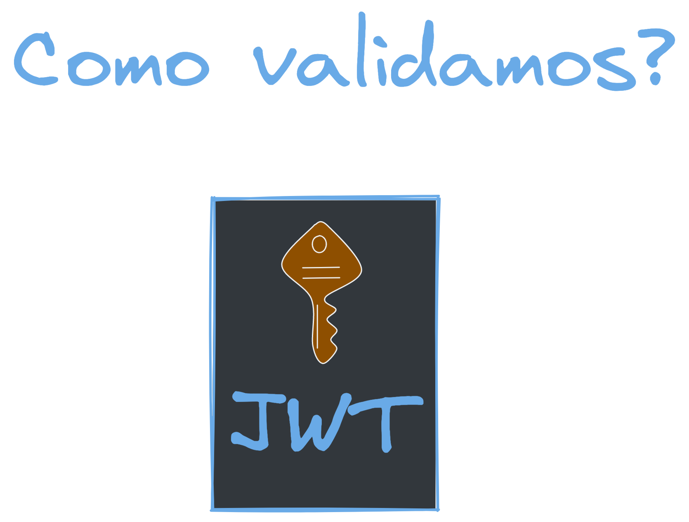{width=80%}

---

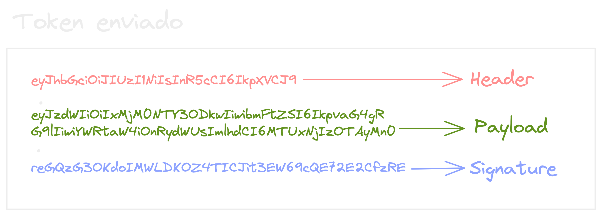

---

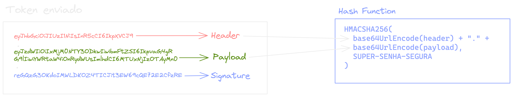

---

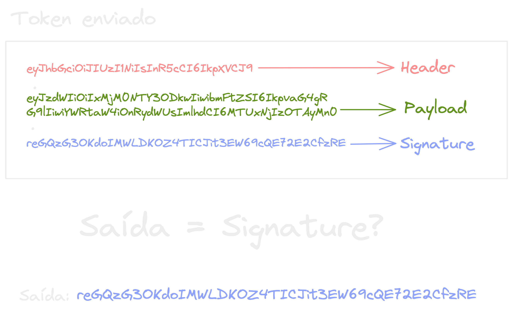

---

### E se alguém tentar adicionar uma permissão no token?

- Vai mudar o Payload
- A assinatura vai bater?

---

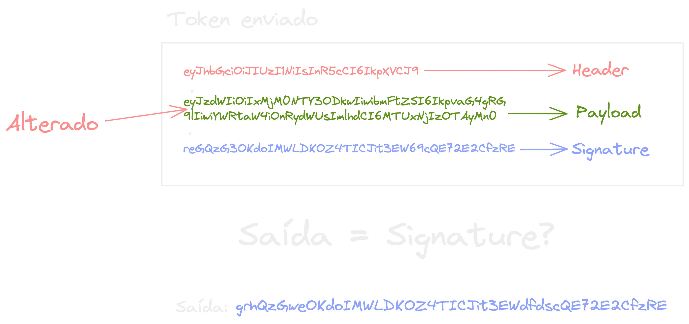

---

### Dúvidas?

{ width=90% }